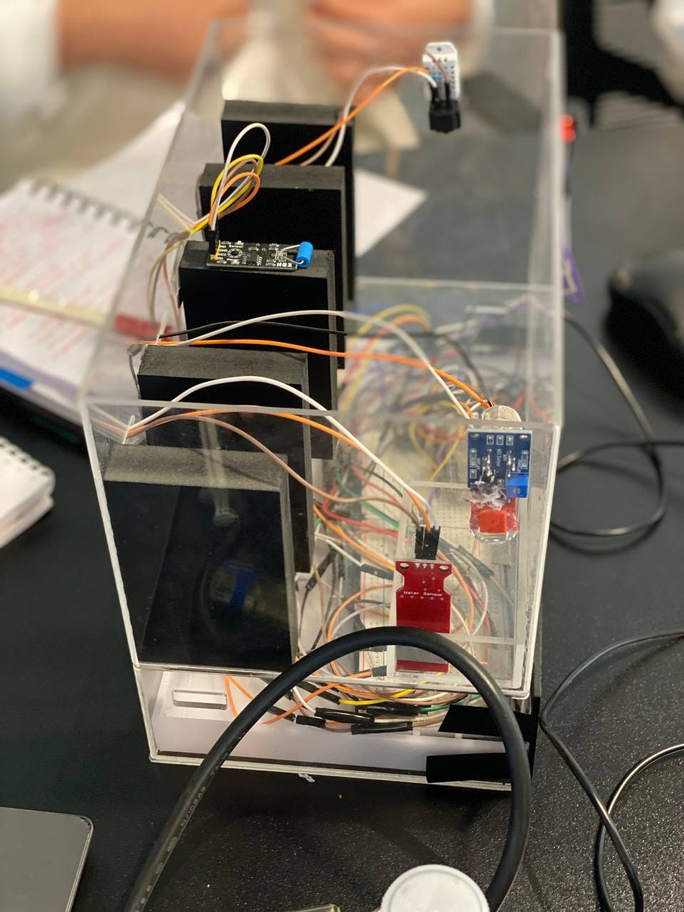

# Securing WISE Data Center Using IoT 

<!-- TABLE OF CONTENTS -->

  
Table of Contents

  <ol>
    <li><a href="#about-the-project">About The Project</a></li>
    <li><a href="#project-objectives">Project Objectives</a></li>
    <li><a href="#built-with">Built With</a></li>
    <ul>
      <li><a href="#hardware-tools">Hardware Tools</a></li>
      <li><a href="#software-and-tools">Software and Tools</a></li>
    </ul>
    <li><a href="#running-the-code">Running the Code</a></li>
    <ul>
      <li><a href="#running-the-arduino-code-esp32_code">Running the Arduino Code `ESP32_code`</a></li>
      <li><a href="#running-the-web-application-securingwisedatacenter">Running the Web Application `SecuringWISEDataCenter`</a></li>
    </ul>
    <li><a href="#diagrams">Diagrams</a></li>
    <ul>
      <li><a href="#data-flow-diagram-0">Data Flow Diagram-0</a></li>
      <li><a href="#data-flow-diagram-1">Data Flow Diagram-1</a></li>
      <li><a href="#use-case-diagram">Use Case Diagram</a></li>
    </ul>
    <li><a href="#contact">Contact</a></li>
  </ol>

<!-- ABOUT THE PROJECT -->
## About The Project

  

  
The project endeavors to bolster the security measures of The World Islamic Sciences and Education University's (WISE) Data Center (DC) through the utilization of cutting-edge Internet of Things (IoT) technology and sophisticated sensor systems. By harnessing the capabilities of IoT devices and sensors, the project aims to conduct continuous, real-time monitoring of the DC, promptly identifying any deviations that may arise. These variations encompass fluctuations in temperature and humidity, gas emissions, water leaks, and server vibrations. Through vigilant monitoring of these parameters, the system ensures the preservation of confidentiality, integrity, and accessibility within the data center's infrastructure. Ultimately, the project's objectives include the prevention of equipment downtimes, the mitigation of potential damages resulting from hazards such as gas and water leaks, and the enhancement of anti-theft measures through the detection of server vibrations.

### Project Objectives
1. Propose a new system using IoT technology and sensors to monitor the WISE DC.
2. Monitor suitable temperature in the server room to prevent equipment downtime and maintain system performance.
3. Minimize damage caused by gas leaks and take immediate action using gas sensors.
4. Detect water leaks in the DC to minimize water damage.
5. Detect server vibrations for anti-theft measures and take appropriate action promptly.

<a href="#top">Back to Top</a>

## Built With

### Hardware Tools
- NodeMCU ESP32 ⚙️
- Mini Breadboard 🔌
- Vibration Sensor Module Switch SW-420 🔔
- DHT22 Digital Temperature and Humidity Sensor 🌡️
- MQ2 Smoke and Flammable Gas Sensor 🔥
- Rain Eater Level Detection Sensor Module ☔ 
- LED 💡
- 5V Magnetic Buzzer 🔊
- Resistors ⚡

### Software and Tools

<a href="#top">Back to Top</a>

## Running the Code

### Running the Arduino Code `ESP32_code`

To run the Arduino code for the Securing WISE Data Center Using IoT, follow these steps:

1. **Hardware Setup**: Connect the necessary sensors (DHT22, MQ2, rainwater, and vibration sensor) and components (LED and buzzer) to your NodeMCU ESP32 board according to the specified pin configurations in the code.

2. **Software Setup**:
   - Open the Arduino IDE or VS Code with the PlatformIO extension.
   - Install the required libraries: DHT sensor library, WiFi library, HTTPClient library.
   - Create a new Arduino sketch and copy the provided code from the `ESP32_code` folder into the sketch.

3. **Configure Wi-Fi Credentials**: Set your Wi-Fi network SSID and password in the `ssid` and `password` variables respectively.

4. **Configure Server Host**: Set the host address of the server where you want to send the sensor data in the `host` variable.

5. **Upload the Code**: Compile and upload the code to your NodeMCU ESP32 board.

<a href="#top">Back to Top</a>

### Running the Web Application `SecuringWISEDataCenter`

To run the web application for the Securing WISE Data Center Using IoT project, follow these steps:

1. **Web Server Setup**: Ensure you have a web server environment set up on your machine. You can use solutions like XAMPP, WAMP, or MAMP for local development.

2. **Database Setup**: Import the provided SQL file (`wise_datacenter.sql`) from the `SecuringWISEDataCenter` folder into your MySQL database to create the necessary tables and schema.

3. **Configure Database Connection**: Open the PHP files in the `SecuringWISEDataCenter` folder and update the database connection details (host, username, password, database name) as per your local setup.

By following these steps, you can set up and run both the Arduino code and web application for your WISE Data Center project.

<a href="#top">Back to Top</a>

## Diagrams

### Data Flow Diagram-0
- **Description:** Overview of the system's scope, boundaries, and external entities.
- **Location:** [Data Flow Diagram-0](DiagramsImg/DataFlowDiagram-0.png)

### Data Flow Diagram-1
- **Description:** Illustrates data flow, processes, and storage within the system.
- **Location:** [Data Flow Diagram-1](DiagramsImg/DataFlowDiagram-1.png)

### Use Case Diagram
- **Description:** Displays system functionality and actor-interaction scenarios.
- **Location:** [Use Case Diagram](DiagramsImg/UseCaseDiagram.png)

<a href="#top">Back to Top</a>

## Contact with us

Raghad AlKatout - [Github](https://github.com/Raghadkatout08) - [LinkedIn](https://www.linkedin.com/in/raghad-alkatout-263949211/)  

Balqees Hmoud - [Github](https://github.com/balqeesHmoud) - [LinkedIn](https://www.linkedin.com/in/balqees-hmoud-511ba4245/)  

Razan Elkhateeb - [Github](https://github.com/RazanElkhateeb) - [LinkedIn](https://www.linkedin.com/in/razan-elkhateeb-826682253/)  

Project Link: [https://github.com/Securing-WISE-DataCenter-Using-IoT](https://github.com/Securing-WISE-DataCenter-Using-IoT/SecuringDataCenter.git)

<a href="#top">Back to Top</a>

